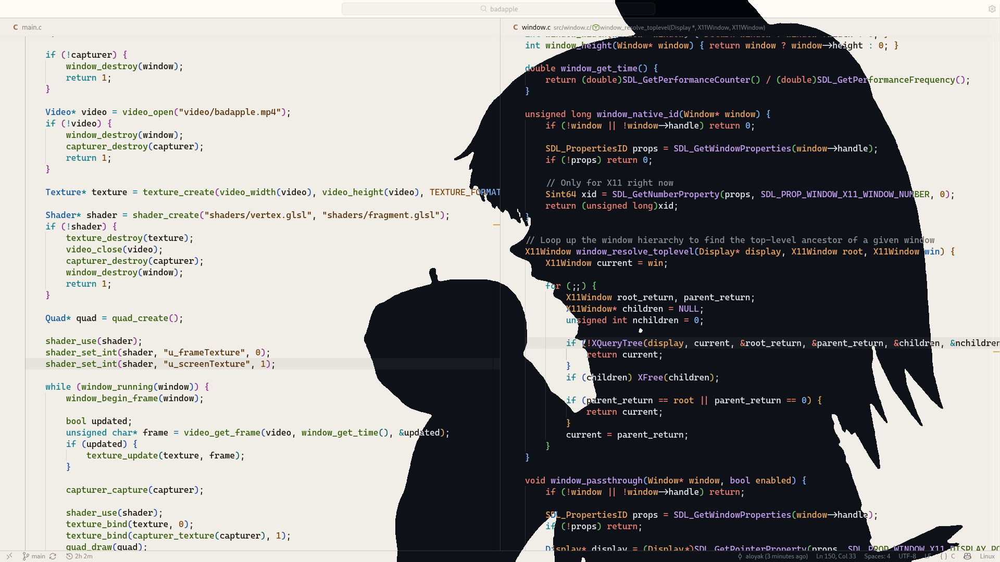

# Bad Apple!!

https://www.youtube.com/watch?v=a1_1RXaRt74

<p align="center">
  
</p>

## Overview

This project started as a simple experiment to create a version of the "Bad Apple" videoclip running on top of the screen in real time.

Interestingly, this same code base happened to have some potential to be used in more general scenarios. It can be used as a postprocessing layer 
that runs on top of the screen and thus can be used to apply any effects to the screen buffer in real time with the huge power and flexibility of
OpenGL's shaders.

## Supported Platforms

This project is supported on Linux (With X11 or Wayland) and Windows

## Building

This project uses CMake as a build system. Requires **CMake 4.0 or higher**.

Note that all dependencies are included with CMake's FetchContent module

If using **Linux**, you might want to check what backend you are running:

```sh
echo $XDG_SESSION_TYPE
```

### X11

```sh
git clone https://github.com/aloyak/badapple.git
cd badapple
chmod +x build.sh
./build.sh --x11
```

### Wayland

```sh
# same as before
./build.sh --wayland
```

### Windows

Consider using Cmake GUI to configure and generate the project, the cmake configuration is already setup to recognize the windows platform and use the correct dependencies